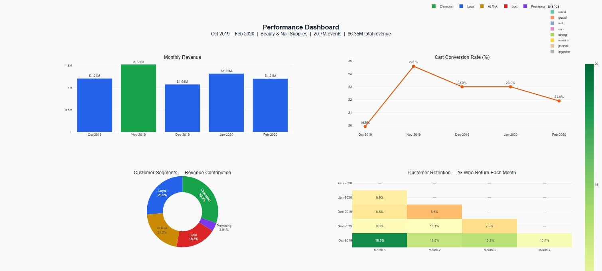
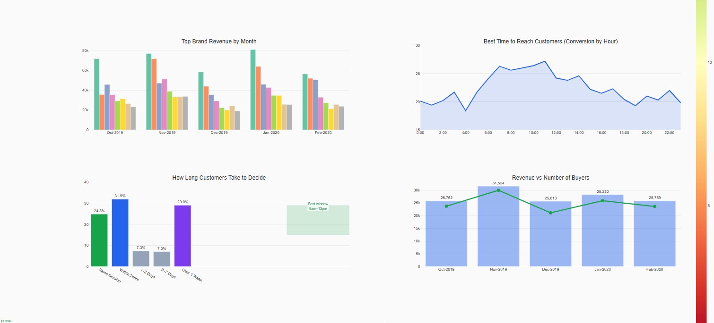
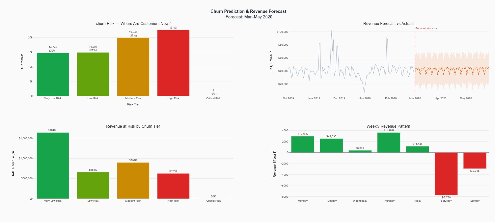
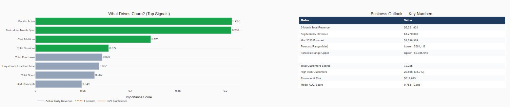
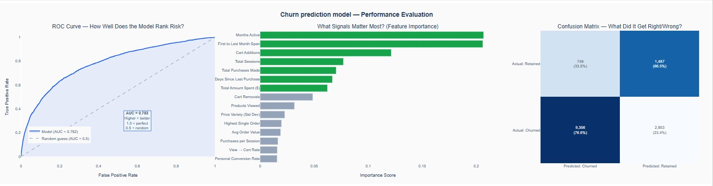
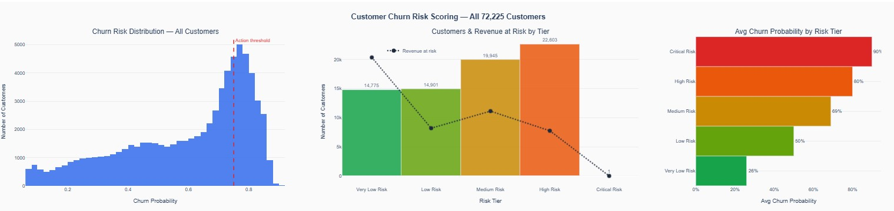

# SAAS Store Revenue & Customer Analytics
### From a single observation to a $1.2M recovery roadmap

[](https://python.org)
[](https://duckdb.org)
[](https://scikit-learn.org)
[](https://facebook.github.io/prophet/)
[](https://public.tableau.com/views/CustomerAcquisitionVisualisationchartsanddashboard/CustomerDashboard)
[](https://github.com/kiobov/Analytics/blob/master/RevenueandCustomerInsights/Notebook.ipynb)

---

> *"Our sales feel inconsistent, we spend on customers who don't come back, and we have no idea what next quarter looks like."*  
> - The business owner, before this analysis

That one sentence drove everything you'll find in this repo.

---

## What This Is

Five months of raw event data (Oct 2019 – Feb 2020) from a cosmetics and nail supplies store. 20.7 million events. One analyst. Without a preplanned project scope the first SQL query confirmed something was wrong, and then followed the data wherever it led.

The result: three answered business questions, Tableau and plotly dashboards, a production ready churn model, a 90 day revenue forecast, and a prioritised action plan with dollar values attached to each recommendation.

| Metric | Value |
|---|---|
| Total events analysed | 20,692,840 |
| Revenue across 5 months | $6.35M |
| Customers scored by churn model | 72,225 |
| Churn model AUC | 0.783 |
| Recoverable revenue identified | $1.2M/yr |


## The Story

We started with querying the month of December 

which showed that 70% of customers who added something to their cart never bought it. That single observation became the spine of everything that followed. Each answer raised the next question. Each question led to a new layer of the analysis.

| Step | What We Found | What It Raised |
|---|---|---|
| 1 | 70% cart abandonment in December | Is this every month, or just December? |
| 2 | Same rate across all 5 months | Which products are bleeding the most money? |
| 3 | November revenue spiked +26%, then December crashed | Why? Prices didn't change. Conversion didn't change. |
| 4 | Black Friday pulled demand forward December just ran out of buyers | Can we predict which customers are about to churn? |
| 5 | 80–90% of first month buyers never return | Can we score all 72K customers for risk? |
| 6 | Random Forest model hits AUC 0.783 | What does revenue actually look like next quarter? |
| 7 | Prophet forecast: flat at $1.2M/month no organic growth | What should the business actually do about all of this? |

This is what the analysis looked like in practice a thread you keep pulling.

---

## Dashboards


Several charts built for a non-technical stakeholder audience. Each one answers a specific business question.

| # | Dashboard | What It Shows |
|---|---|---|
| 1 | **Monthly Revenue & Buyers** | $6.35M broken down month by month with the Black Friday spike visible |
| 2 | **Conversion Funnel** | Where in the journey customers drop off (answer: cart to purchase) |
| 3 | **Cart Abandonment by Brand** | Which products lose the most revenue at the checkout stage |
| 4 | **Cohort Retention Heatmap** | Only 8–18% of buyers return after their first month |
| 5 | **Top Brand Revenue** | grattol up 46%, runail down 21% who's winning and losing |
| 6 | **Conversion by Hour** | 9–12am peak, especially Thursdays when to run campaigns |
| 7 | **Purchase Decision Timeline** | 32% of buyers decide within 24 hours of first view |
| 8 | **Revenue vs. Buyers Trend** | Why November's buyer surge drove all the revenue growth |



part1


part2


---

## Churn Prediction Model

**The ask:** identify which customers are at risk of leaving before they actually go.

**The approach:** Random Forest classifier trained on October–December buyer behaviour, tested against whether those customers returned in January–February. A time based split not random because you always predict future behaviour from past behaviour.

### Why this was tricky

84.5% of early buyers churned. A model that just predicts "churned" for everyone would hit 84.5% accuracy and be completely useless. `class_weight='balanced'` forces the model to treat both groups equally regardless of size.

### Features (15 behavioural signals)

The two most predictive features weren't spend they were **loyalty signals**:

| Feature | Why It Matters |
|---|---|
| First Last Month Span | How consistently they bought over time |
| Months Active | Whether they spread purchases across multiple months |
| Cart Additions | Strong intent signal serious shoppers, not browsers |
| Total Purchases | Purchase volume |
| Days Since Last Purchase | Classic recency indicator (ranked #6 — loyalty signals beat it) |

### Results

| Metric | Value |
|---|---|
| ROC-AUC (test set) | **0.7834** |
| Cross-validation AUC (5-fold) | **0.7833 ± 0.0086** stable, not a fluke |
| Churners correctly flagged | 9,368 of 12,209 (76.7%) |
| Industry threshold for production use | >0.70 |

### Churn Risk Tiers - What to Do with Them

| Tier | Customers | Churn Probability | Revenue at Risk | Action |
|---|---|---|---|---|
| Very Low Risk | 14,660 | 25% | $1.64M | Protect with loyalty programme |
| Low Risk | 15,074 | 50% | $674K | Monitor, light re-engagement |
| **Medium Risk** | **19,623** | **69%** | **$897K** | ** Target first: still reachable** |
| High Risk | 22,868 | 80% | $613K | Low cost automated email only |



part1 


part2

---

## Revenue Forecast

**Tool:** Facebook Prophet with Black Friday explicitly modelled as a holiday (3-day lead, 3-day lag window).

### March–May 2020 Forecast

| Month | Central Forecast | 95% Lower | 95% Upper |
|---|---|---|---|
| March 2020 | $1,298,369 | $564K | $2.04M |
| April 2020 | $1,263,393 | $549K | $1.98M |
| May 2020 | $1,223,564 | $531K | $1.90M |

The wide confidence intervals are intentional with 5 months of data, narrow bands would be false precision. Budget conservatively at **$1.2M/month**.

### The warning in the numbers

The Prophet trend line is flat at $40K/day across all 5 months. No upward trajectory. This store is stable, but it is not growing. Without deliberate action on retention or product expansion, it stays exactly where it is.

### When to spend (weekly pattern)

| Day | Revenue Effect | What to Do |
|---|---|---|
| **Thursday** | **+$3,626** | Launch campaigns, send emails |
| Monday | +$2,955 | Re-engagement sequences |
| Tuesday | +$2,530 | Schedule promotions |
| Saturday | **-$7,730** | Nothing. Don't launch anything. |



part1


part2

[alt text](images/revenueforecast.jpg)
part3

---

## System Architecture

```
Raw Data (5 CSV files, 20.7M rows)
         │
         ▼
  pandas.read_csv()
  + pd.concat() with month labels
         │
         ▼
    DuckDB SQL Engine
  (queries directly on DataFrames without a database setup)
         │
    ┌────┴─────────────────────┐
    ▼                          ▼
SQL Analysis                Cohort / RFM
- Funnel                    - Retention heatmap
- Revenue by month          - RFM segmentation
- Cart abandonment          - Customer scoring
- Brand performance              │
         │                       ▼
         │              Random Forest Classifier
         │              - 15 features
         │              - class_weight=balanced
         │              - AUC 0.783
         │                       │
         └────────┬──────────────┘
                  ▼
         Facebook Prophet
         - Trend decomposition
         - Black Friday holiday model
         - 90-day forward forecast
                  │
         ┌────────┴────────────┐
         ▼                     ▼
  Plotly (inline charts)   Plotly (stakeholder dashboards)
  HTML export              8 interactive views
```


## Key Findings

**1. The cart abandonment problem**  
70% of customers who add to cart never purchase or are consistent across all 5 months. The worst offenders are high price items: the brand *strong* at $194/unit has only a 20% buy rate. Every recovered cart is worth $194.

**2. November didn't help December**  
December's 30% revenue drop had nothing to do with pricing, product, or conversion rate all three were stable. Black Friday pulled 6,000 buyers forward from December. Planning problem, not operational problem.

**3. Retention is the core issue**  
80–90% of new buyers never return after month 1. The 15% who did return consistently are identifiable and they drive disproportionate revenue. Champions (top segment) are 15% of customers but 31% of all revenue.

**4. The business is plateauing**  
$6.35M over 5 months looks healthy. But the trend is flat. There's no organic growth engine. The money in this report is all recovery, not growth and recovery alone buys time, not trajectory.

---

## Recommendations

Ranked by revenue impact and implementation effort:

| Priority | Action | Estimated Impact | Effort |
|---|---|---|---|
|CRITICAL | Fix checkout friction for items $100+ | $635K+/yr | Medium |
|HIGH | Cart abandonment email at 20hour mark | $190K recoverable | Low |
|HIGH | Re-engage Medium Risk segment with 10% discount | $269K if 30% respond | Low |
|HIGH | Champion loyalty programme (early access, free shipping) | Protects $1.96M | Medium |
|MEDIUM | Diagnose masura brand decline (-32% over 5 months) | Protects $140K | Medium |
|MEDIUM | Schedule all campaigns Thu–Fri 9am–12pm | Efficiency gain | Low |
|MEDIUM | Day-6 reminder email for slow deciders | $85K+ recoverable | Low |

**Total recoverable revenue identified: $1.2M/year**

---

## Project Files

| File | What It Is |
|---|---|
| `Notebook.ipynb` | Main notebook - all SQL, analysis, modelling, and charts |
| `performancedashboard.html` | Interactive 8-chart stakeholder dashboard (open in browser) |
| `churn pred & revenue forecast.html` | Churn + forecast combined model summary |
| `2019-Oct.csv` to `2020-Feb.csv` | Raw data (sourced from Kaggle, loaded via Google Drive) |

---

## Stack

| Tool | Used For |
|---|---|
| **Python** | Everything |
| **DuckDB** | SQL queries directly on pandas DataFrames - no database setup |
| **pandas** | Data loading, merging, preprocessing |
| **scikit-learn** | Random Forest classifier, cross-validation |
| **Facebook Prophet** | Time series decomposition and forecasting |
| **Plotly** | Interactive inline charts |
| **Tableau Public** | Stakeholder-facing dashboards |
| **Google Colab** | Development environment |

---

## Limitations & What's Next

- **5 months of data** caps Prophet's accuracy. 12+ months would significantly tighten forecast confidence intervals and finally capture a full seasonal cycle.
- **Binary churn labels** are a simplification. A model scoring declining purchase frequency over time would add more nuance to the risk tiers.
- **Cart abandonment model** predicting *which* carts actually respond to reminders is the highest ROI next modelling step and isn't built yet.
- **Product recommendation engine** using collaborative filtering on view/purchase events would close the loop on personalisation.
- **Tableau deployment** for a shareable link and Automation

---

## Data Source

[eCommerce Events History in Cosmetics Shop](https://www.kaggle.com/datasets/mkechinov/ecommerce-events-history-in-cosmetics-shop) Kaggle  
152 days · 20,692,840 events · Oct 2019-Feb 2020

---

*Built end to end: data loading → SQL analysis → cohort analysis → RFM segmentation → churn model → revenue forecast → stakeholder dashboards → business recommendations.*
